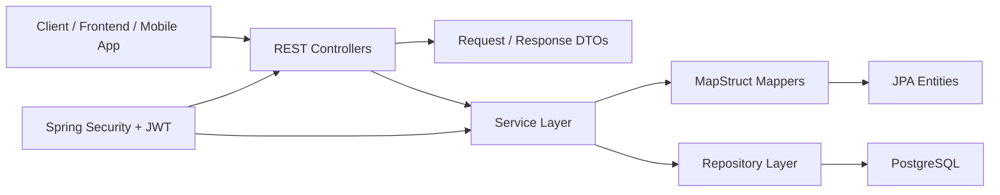
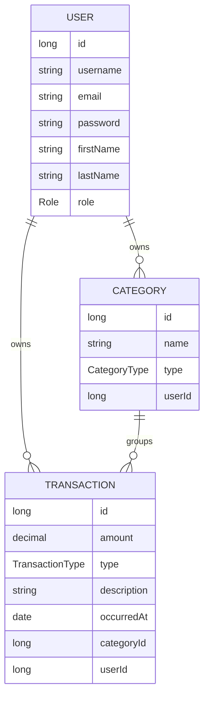

# Expense Tracker API Architecture

## Цель проекта

`expense-tracker-api` - backend-сервис для учета личных расходов и доходов. API должно позволять пользователю регистрироваться, входить в систему, создавать финансовые операции, группировать их по категориям и получать базовую аналитику по своему бюджету.

Проект строится как Spring Boot REST API с PostgreSQL, Spring Security, JPA, DTO-контрактами и сервисным слоем для бизнес-логики.

## Текущий стек

- Java 17
- Spring Boot 4
- Spring Web MVC
- Spring Security
- Spring Data JPA
- PostgreSQL
- Bean Validation
- Lombok
- MapStruct
- JJWT
- Springdoc OpenAPI
- Gradle

## Общая схема



## Слои приложения

### REST layer

Пакет: `com.disa.expensetrackerapi.rest`

Отвечает за HTTP-контракты:

- принимает request DTO;
- запускает validation;
- вызывает сервисы;
- возвращает response DTO;
- не содержит бизнес-логику и прямую работу с базой данных.

Текущий класс:

- `AuthController` - точка входа для регистрации и авторизации.

Целевой формат endpoint-ов:

- `POST /api/auth/register`
- `POST /api/auth/login`
- `GET /api/users/me`
- `POST /api/transactions`
- `GET /api/transactions`
- `GET /api/categories`
- `GET /api/reports/summary`

### Service layer

Пакеты:

- `com.disa.expensetrackerapi.service`
- `com.disa.expensetrackerapi.service.impl`

Отвечает за бизнес-сценарии:

- регистрация пользователя;
- проверка учетных данных;
- генерация JWT;
- создание операций;
- расчет балансов и отчетов;
- проверка доступа к пользовательским данным.

Текущие классы:

- `AuthService`
- `AuthServiceImpl`

Правило: контроллер вызывает только сервис, а сервис уже работает с repository, mapper, password encoder, token provider и другими компонентами.

### Repository layer

Пакет: `com.disa.expensetrackerapi.repo`

Отвечает за доступ к данным через Spring Data JPA.

Текущий класс:

- `UserRepository`

Целевые repository:

- `UserRepository`
- `CategoryRepository`
- `TransactionRepository`

Repository не должен содержать бизнес-правила. Его задача - запросить, сохранить или удалить данные.

### Domain layer

Пакеты:

- `com.disa.expensetrackerapi.domain.entity`
- `com.disa.expensetrackerapi.domain.dto`
- `com.disa.expensetrackerapi.enums`

Отвечает за структуру данных приложения.

Текущие сущности и enum:

- `User`
- `Role`

Целевая доменная модель:



### Mapper layer

Пакет: `com.disa.expensetrackerapi.mapper`

MapStruct используется для преобразований между entity и DTO.

Текущий класс:

- `UserMapper`

Целевые mapper-ы:

- `UserMapper`
- `CategoryMapper`
- `TransactionMapper`

Правило: entity не возвращаются напрямую из REST API. Наружу отдаются response DTO.

### Config layer

Пакет: `com.disa.expensetrackerapi.config`

Отвечает за техническую конфигурацию приложения.

Текущий класс:

- `SecurityConfig`

Целевые config-компоненты:

- `SecurityConfig` - правила доступа и filter chain;
- `JwtAuthenticationFilter` - извлечение токена из запроса;
- `JwtService` или `TokenProvider` - генерация и проверка JWT;
- `OpenApiConfig` - настройка Swagger/OpenAPI при необходимости.

## Авторизация и безопасность

Целевая схема:

1. Пользователь отправляет `POST /api/auth/register` или `POST /api/auth/login`.
2. `AuthController` принимает DTO и передает данные в `AuthService`.
3. `AuthService` проверяет пользователя через `UserRepository`.
4. Пароль хранится только в виде BCrypt hash.
5. После успешного входа API возвращает JWT.
6. Для защищенных endpoint-ов клиент отправляет `Authorization: Bearer <token>`.
7. JWT-фильтр проверяет токен и устанавливает пользователя в `SecurityContext`.

Публичные endpoint-ы:

- `/api/auth/register`
- `/api/auth/login`
- `/swagger-ui/**`
- `/v3/api-docs/**`

Остальные endpoint-ы должны требовать авторизацию.

## Ошибки и validation

DTO должны использовать Bean Validation:

- `@NotBlank`
- `@Email`
- `@Size`
- `@Positive`
- `@NotNull`

Для ошибок стоит добавить общий обработчик:

- `GlobalExceptionHandler`
- `ErrorResponse`

Целевые HTTP-ответы:

- `400 Bad Request` - validation error;
- `401 Unauthorized` - пользователь не авторизован;
- `403 Forbidden` - нет доступа к ресурсу;
- `404 Not Found` - сущность не найдена;
- `409 Conflict` - email или username уже заняты;
- `500 Internal Server Error` - непредвиденная ошибка.

## Пакетная структура

Текущая структура уже близка к слоистой архитектуре:

```text
com.disa.expensetrackerapi
+-- config
+-- domain
|   +-- dto
|   |   +-- auth
|   +-- entity
+-- enums
+-- mapper
+-- repo
+-- rest
+-- service
|   +-- impl
+-- ExpenseTrackerApiApplication
```

Целевая структура по мере роста:

```text
com.disa.expensetrackerapi
+-- config
+-- domain
|   +-- dto
|   |   +-- auth
|   |   +-- category
|   |   +-- transaction
|   |   +-- user
|   +-- entity
+-- enums
+-- exception
+-- mapper
+-- repo
+-- rest
+-- security
+-- service
    +-- impl
```

## Основные модули

### Auth module

Назначение:

- регистрация;
- вход;
- выдача JWT;
- шифрование пароля;
- получение текущего пользователя.

Ключевые классы:

- `AuthController`
- `AuthService`
- `AuthServiceImpl`
- `UserRepository`
- `SecurityConfig`
- `JwtService`

### User module

Назначение:

- хранение профиля пользователя;
- получение данных текущего пользователя;
- возможное обновление имени, фамилии, email.

Ключевые классы:

- `User`
- `UserRepository`
- `UserMapper`
- `UserController`
- `UserService`

### Category module

Назначение:

- пользовательские категории расходов и доходов;
- фильтрация категорий по типу;
- запрет доступа к чужим категориям.

Ключевые классы:

- `Category`
- `CategoryType`
- `CategoryRepository`
- `CategoryController`
- `CategoryService`
- `CategoryMapper`

### Transaction module

Назначение:

- создание доходов и расходов;
- редактирование и удаление операций;
- фильтрация по дате, типу, категории;
- расчет баланса.

Ключевые классы:

- `Transaction`
- `TransactionType`
- `TransactionRepository`
- `TransactionController`
- `TransactionService`
- `TransactionMapper`

### Reports module

Назначение:

- сводка доходов и расходов;
- баланс за период;
- группировка по категориям;
- месячная аналитика.

Ключевые классы:

- `ReportController`
- `ReportService`
- `SummaryResponse`
- `CategorySummaryResponse`

## Работа с базой данных

Целевая база данных: PostgreSQL.

Основные таблицы:

- `users`
- `categories`
- `transactions`

Рекомендуемые правила:

- все пользовательские данные должны быть связаны с `user_id`;
- запросы должны фильтровать данные по текущему пользователю;
- денежные значения хранить в `BigDecimal`;
- даты операций хранить отдельно от даты создания записи;
- добавить audit-поля `createdAt` и `updatedAt`.

## API contracts

Пример auth DTO:

```json
{
  "usernameOrEmail": "user@example.com",
  "password": "secret"
}
```

Пример auth response:

```json
{
  "accessToken": "jwt-token",
  "tokenType": "Bearer"
}
```

Пример transaction request:

```json
{
  "amount": 1200.50,
  "type": "EXPENSE",
  "categoryId": 1,
  "description": "Groceries",
  "occurredAt": "2026-05-05"
}
```

## Тестирование

Минимальный набор тестов:

- context load test;
- auth service registration test;
- auth service login test;
- controller validation tests;
- repository tests для основных запросов;
- security tests для закрытых endpoint-ов.

Для интеграционных тестов можно использовать Testcontainers с PostgreSQL, если проекту понадобится проверять реальные SQL-сценарии.

## Roadmap реализации

1. Довести auth-модуль до рабочего состояния:
   - заполнить `AuthRequest`;
   - заполнить `AuthResponse`;
   - добавить register/login endpoint-ы;
   - добавить JWT service;
   - закрыть все endpoint-ы кроме auth и swagger.
2. Расширить `User`:
   - добавить `role`;
   - добавить validation constraints;
   - добавить audit-поля.
3. Добавить обработку ошибок:
   - `GlobalExceptionHandler`;
   - `ErrorResponse`;
   - доменные exception-ы.
4. Добавить категории:
   - entity;
   - DTO;
   - mapper;
   - repository;
   - service;
   - controller.
5. Добавить операции:
   - entity;
   - DTO;
   - mapper;
   - repository;
   - service;
   - controller.
6. Добавить отчеты:
   - summary по периоду;
   - группировка по категориям;
   - общий баланс.
7. Добавить OpenAPI-описание и расширить тесты.

## Архитектурные правила

- Controller не работает напрямую с repository.
- Entity не возвращаются напрямую из API.
- Пароли никогда не хранятся и не возвращаются в открытом виде.
- Все пользовательские данные фильтруются по текущему пользователю.
- Бизнес-логика живет в service layer.
- DTO отвечают за внешний контракт API.
- Mapper отвечает за преобразование DTO/entity.
- Repository отвечает только за persistence.
- Security-настройки держатся отдельно от бизнес-логики.
